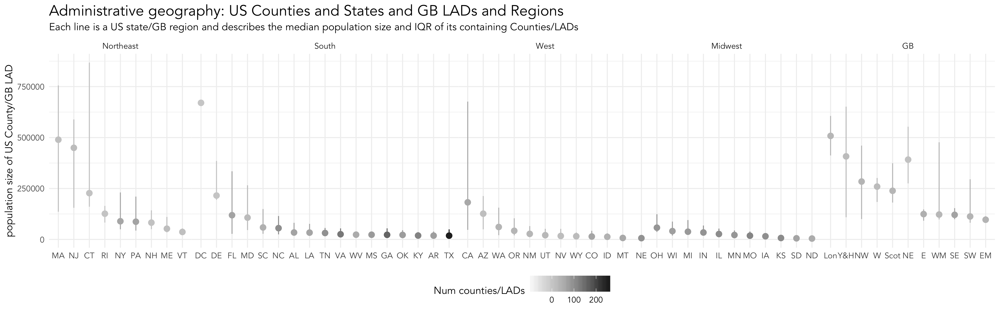
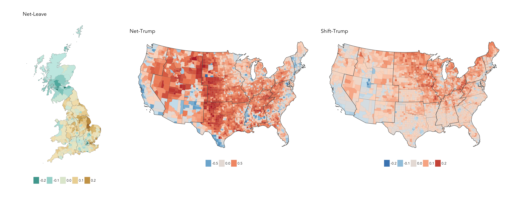
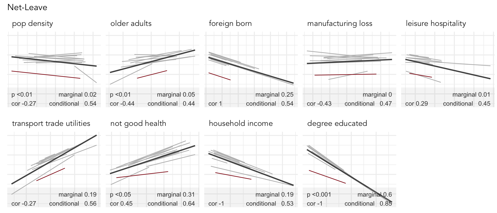
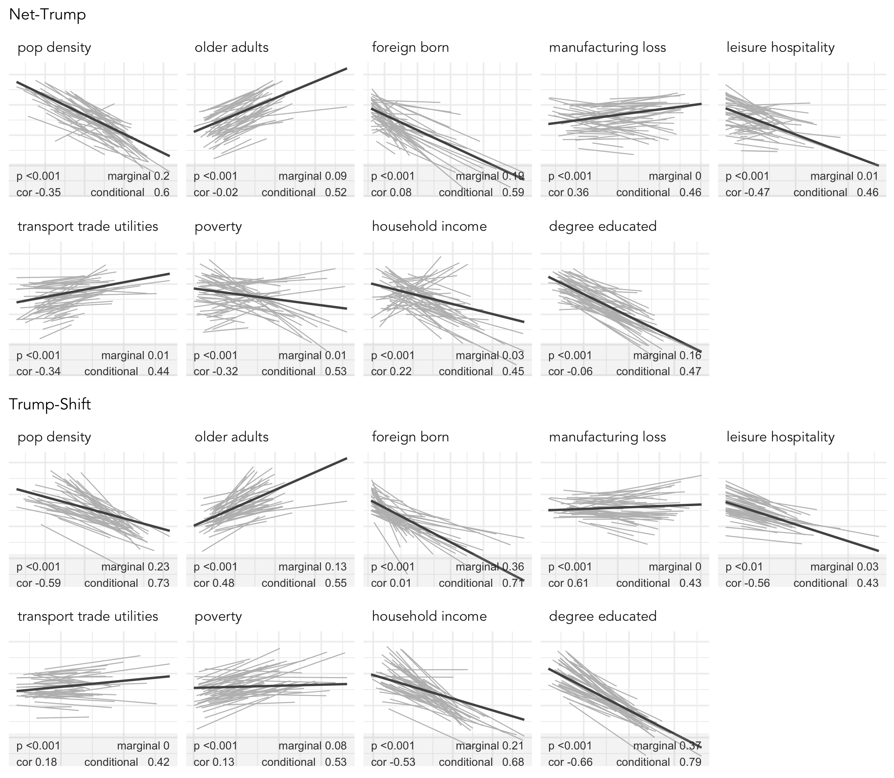
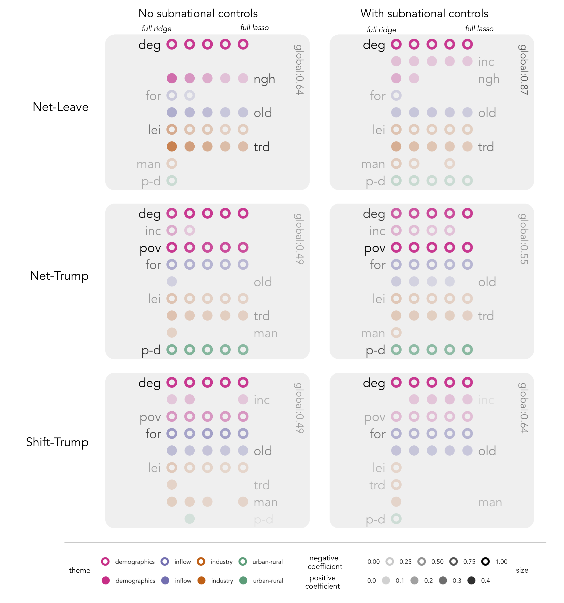
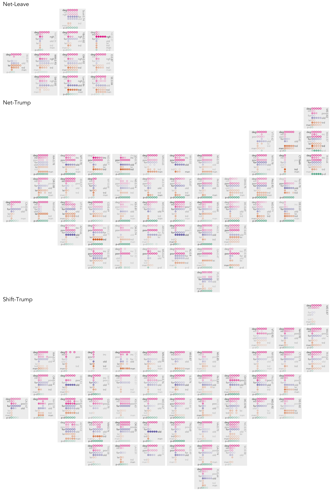

This repository contains additional code and material for our paper _Regionally-structured explanations behind area-level populism: An update to recent ecological analyses_.

The data in this repository (found in [data/](data/)) is assembled from:

_Voting data_

* [Electoral Commision](https://www.electoralcommission.org.uk) : area-level UK Referendum data.
* [Tony McGovern](https://github.com/tonmcg/County_Level_Election_Results_12-16) : area-level US Presidential Election data.

_Demographic and context data_

* [ONS](https://www.ons.gov.uk) : 2011 UK Census.
* [Casweb](http://casweb.ukdataservice.ac.uk) : 1971 UK Census.
* [US Census Bureau](https://www.census.gov/en.html) : 2010 US Census.
* [NHGIS](https://www.nhgis.org) : 1970 US Census.

_Boundary data_

* [US Census Bureau](https://www.census.gov/geo/maps-data/data/tiger-cart-boundary.html) : US Boundary data.
* [ONS Open Geography Portal](http://geoportal.statistics.gov.uk) : GB Boundary data.

This repository contains:

* [README.md](README.md) : This file, which provides code and detail around the data analysis that is additional to that appearing in the paper.
* [src/](src/) : R files, introduced below, with more subtantial code chunks or with helper functions.
* [figures/](figures/) : Figures generated from the code used in this file.


## Required Libraries

The following are available on CRAN and can be installed with `install.packages(<package_name>)`:

```{r, install_libraries, eval=FALSE}
library(tidyverse)              # bundle of packages for data manipulation 
library(sf)                     # for working with geospatial data
library(lme4)                   # for multilevel modelling
library(piecewiseSEM)           # for multilevel modelling diagnostics
library(glmnet)                 # for penalised regression

# Set ggplot2 theme_minimal().
theme_set(theme_minimal())
```

## Load data 

A script for processing the Census and Boundary data is in the [src/](src/) folder (`data_processing.R`). Calling this script writes out processed files separately for GB and US as `.geojson` to the [/data](/data) folder.   

In the code below we first load the Brexit dataset.  Using `glance(<df_name>)`, notice that it consists of 380 observations (Local Authority Districts -- LADs) and 19 variables. These are listed for a sample LAD in the block below. Vote data are not published at LAD-level for Northern Ireland and so we analyse the 380 LADs in Great Britain only.

```{r, brexit_data, eval=FALSE}
# Read in data.
brexit_data <- st_read("./data/brexit.geojson")

# Sample LAD.
# $ lad_code                  <chr> "E09000033" 
# $ lad_name                  <fct> Westminster
# $ region_name               <chr> "London"
# $ region_abbr               <chr> "Lon"
# $ gridX                     <dbl> 3
# $ gridY                     <dbl> 4
# $ total_pop                 <int> 438792
# $ share_leave               <dbl> 0.3103484
# $ net_leave                 <dbl> -0.1896516
# $ degree_educated           <dbl> 0.5755543
# $ not_good_health           <dbl> 0.1585307
# $ household_income          <int> 44027
# $ transport_trade_utilities <dbl> 0.1553891
# $ leisure_hospitality       <dbl> 0.06538105
# $ manufacturing_loss        <dbl> 0.1067614
# $ foreign_born              <dbl> 0.5332321
# $ older_adults              <dbl> 0.111734
# $ pop_density               <dbl> -3.888546
# $ geometry                  <sf_geometry [degree]> MULTIPOLYGON (((-0.111581 5...
```


Next, load the Trump dataset in the same way. This consists of 3108 observations (counties) and 23 variables. Vote data are not published at county-level for Alaska and Hawaii and so we anlalyse data describing mainland US only.

```{r, trump_data, eval=FALSE}
# Read in data.
trump_data <- st_read("./data/trump.geojson", crs=2163)

# Sample county.
# $ county_code               <chr> "37067"
# $ county_name               <chr> "Forsyth County"
# $ state_name                <chr> "North Carolina"
# $ state_abbr                <chr> "NC"
# $ division                  <chr> "South Atlantic"
# $ gridX                     <int> 8
# $ gridY                     <int> 5
# $ total_pop                 <dbl> 368019
# $ share_trump               <dbl> 0.44711
# $ net_trump                 <dbl> -0.1057801
# $ shift_trump               <dbl> -0.01650177
# $ shift_direction           <chr> "away"
# $ flip                      <chr> "Obama Clinton"
# $ degree_educated           <dbl> 0.336
# $ poverty                   <dbl> 0.175
# $ household_income          <dbl> 27593
# $ leisure_hospitality       <dbl> 0.1101108
# $ transport_trade_utilities <dbl> 0.1806304
# $ manufacturing_loss        <dbl> -0.2721169
# $ foreign_born              <dbl> 0.085
# $ older_adults              <dbl> 0.151
# $ pop_density               <dbl> 0.0003332722
# $ geometry                  <sf_geometry [m]> MULTIPOLYGON (((1736685 -78...
```


## Summarise administrative geography



We treat as similar US counties and states and GB LADs and Government Office Regions (GORs). Since this administrative geography determines the hierarchical structure used in our data analysis, it is worth quickly inspecting how both populations are distributed amongst these geographies. Code for this analysis can be viewed at this position of the repo's [READE.Rmd](README.Rmd) file.

```{r, admin_geog, eval=FALSE, echo=FALSE}
# Generate statistics summarising county-level population size.
admin_geog <- trump_data %>% 
  group_by(state_abbr) %>% 
  summarise(
    region=first(region), num_counties=n(), median_pop_size=median(total_pop), mean_pop=mean(total_pop),
    lower=quantile(total_pop, 0.25), upper=quantile(total_pop, 0.75) ) %>% 
  group_by(region) %>% 
  mutate(median_region=median(median_pop_size)) %>% 
  ungroup() %>% 
  mutate(region=fct_relevel(reorder(region, -median_region)),
         binned_counties=ntile(num_counties,5)) %>%
  group_by(binned_counties) %>%
        mutate(min_counties=min(num_counties),
               max_counties=max(num_counties)) %>%
  ungroup() %>%
  mutate(binned_counties=paste0(min_counties," to ", max_counties, " counties")) %>%
  rename("state"="state_abbr")
st_geometry(admin_geog) <- NULL

# Generate statistics summarising LAD-level population size.
admin_geog_temp <- brexit_data %>% 
  group_by(region_abbr) %>%
  summarise(region="GB", num_counties=n(), median_pop_size=median(total_pop), mean_pop=mean(total_pop), lower=quantile(total_pop, 0.25), upper=quantile(total_pop, 0.75)) %>% 
  rename(state=region_abbr) %>%
  mutate(region=as_factor(region), median_region=0, binned_counties="", min_counties=0, max_counties=0)
st_geometry(admin_geog_temp) <- NULL

# Merge for plotting
admin_geog <- rbind(admin_geog,admin_geog_temp)
rm(admin_geog_temp)

# Plot summary statistics.
admin_geog %>%
  ggplot(aes(x=reorder(state, -median_pop_size), y=median_pop_size))+
    geom_pointrange(aes(ymin=lower, ymax=upper, colour=num_counties))+
    facet_grid(~region, scales="free_x", space="free")+
    labs(x="", y="population size of US County/GB LAD",
      title="Administrative geography: US Counties and States and GB LADs and Regions",
      subtitle="Each line is a US state/GB region and describes the median population size and IQR of its containing Counties/LADs")+
    scale_colour_distiller(palette="Greys",direction=1, name="Num counties/LADs", limits=c(-90,255))+
    theme(
      axis.title.x=element_blank(),
      panel.grid=element_line(colour="#f0f0f0"), 
      legend.position = c("bottom"),
      plot.title=element_text(face="plain", size=16),
      panel.spacing = unit(0, "inches")
    )
```


## Generate maps of results



We consider how the _net-Leave_, _net-Trump_ and _shift-Trump_ vote distributes geographically by generating choropleth maps of the results. Code for generating the maps can be viewed at this position of the repo's [READE.Rmd](README.Rmd) file.

```{r, result_choropleths, eval=FALSE, echo=FALSE}
# Choropleth of Net-Leave
ggplot()+
  geom_sf(data=brexit_data, aes(fill=net_leave), colour="#bdbdbd", size=0.05)+
  coord_sf(crs=st_crs(brexit_data), datum=NA)+
  scale_fill_distiller(type="div",palette=1, direction=-1, limits=c(-0.3,0.3), name="", guide=guide_legend(keywidth=1))+
  labs(title="Net-Leave") +
  theme(axis.title=element_blank(),
        legend.position="bottom")

# Choropleth of Net-Trump.
ggplot()+
  geom_sf(data=trump_data, aes(fill=net_trump), colour="#bdbdbd", size=0.05)+
  coord_sf(crs=st_crs(trump_data), datum=NA)+
  scale_fill_distiller(palette="RdBu", direction=-1, limits=c(-0.95,0.95), name="", guide=guide_legend(keywidth=1))+
  labs(title="Net-Trump") +
  theme(axis.title=element_blank(),
        legend.position = "bottom")

# Choropleth of Shift-Trump
ggplot()+
  geom_sf(data=trump_data, aes(fill=shift_trump), colour="#bdbdbd", size=0.05)+
  coord_sf(crs=st_crs(trump_data), datum=NA)+
  scale_fill_distiller(palette="RdBu", direction=-1, limits=c(-0.25,0.25), name="", guide=guide_legend(keywidth=1))+
  labs(title="Shift-Trump") +
  theme(axis.title=element_blank(),
        legend.position = "bottom")
```

## Generate univariate multilevel models

To explore associations between outcome and explanatory variables, and the scale and nature of regionally-varying effect, we generate univariate multilevel models with GB LADs at level 1 and GORs at level 2 and US counties at level 1 and states at level 2. There are a set of helper functions for generating model summaries and diagnostics. 
```{r, multilevel_functions, eval=FALSE}
source("./src/mutlilevel_helper_functions.R")
```
### Univariate models for the Brexit datasets




Compute multilevel models and summary statistics for interrogating regional scale and effects in the Brexit datasets. Code for generating the models can be viewed at this position of the repo's [READE.Rmd](README.Rmd) file.

```{r, brexit_multilevel_data, eval=FALSE, echo=FALSE}
# Censor household income variable and standardise explanatory variables (for charting).
brexit_multilevel <- brexit_data %>% 
  # Censor household income variable for City of London rather than remove entirely.
  group_by(lad_name) %>% 
  mutate(household_income=min(household_income,42000)) %>%
  ungroup() %>%
  # Standardise explanatory variables.
  mutate_at(vars(degree_educated:pop_density), funs((.-mean(., na.rm=TRUE))/sd(., na.rm=TRUE) ))
# Remove geometry data.
st_geometry(brexit_multilevel) <- NULL

# Create tibble of explanatory variables for iterating over.
x_vars <- brexit_multilevel %>%  select(degree_educated:pop_density) %>% gather(key="var", value="lad_share") %>% group_by(var) %>% summarise()

# Get summary of of how variance distributes within and between regions in random intercept model.
variances <- bind_rows(x_vars %>% pull(var) %>%
                         purrr::map_df(~get_variances(brexit_multilevel,quo(share_leave),.x, quo(region_abbr))))
# Print out to inspect.
variances

# Get fitted values from random intercept and slope model as well model diagnostics for each.
# Diagnostics are duplicated amongst rows as each row is an observation + fitted values for charting.
summary_fitted <- bind_rows(x_vars$var %>% 
                              purrr::map_df(
                                ~get_randoms_fitted(
                                  lmer_intercept(brexit_multilevel,quo(share_leave),.x, quo(region_abbr)),
                                  lmer_slope(brexit_multilevel,quo(share_leave),.x, quo(region_abbr)),
                                  brexit_multilevel,quo(share_leave), .x, quo(region_abbr)))
                            )
```


Plot multilevel Brexit models.  Code for generating the model plots can be viewed at this position of the repo's [READE.Rmd](README.Rmd) file.

```{r, brexit_multilevel_plot, eval=FALSE, echo=FALSE}
# Create factor variable with variable theme for ordering and charting -- also used for plotting multivariate models. 
var_theme <- tibble(var=c("pop_density", "older_adults", "foreign_born","manufacturing_loss", "leisure_hospitality", "transport_trade_utilities","not_good_health", "household_income",  "degree_educated"),
                    short_var=c("p-d","old","for", "man", "lei", "trd", "ngh", "inc","deg"),
                    theme=c("urban-rural", "inflow","inflow", "industry","industry","industry","demographics","demographics","demographics"))  %>%
  mutate(var_label=as_factor(gsub("\\_", " ", var)))

# Merge with data frame containing fitted values and model diagnostics.
summary_fitted <- summary_fitted %>% left_join(var_theme, by=c("var_name"="var")) 

# Create a data frame containing plot labels.  
plot_labels <- summary_fitted %>%
  group_by(var_label) %>%
  summarise(plot_label=paste0("marginal ", round(first(marginal_slope),2),"\n conditional", round(first(conditional_slope),2)),
    xmin=min(var_values), x=max(var_values), y=0.15, likelihood=min(likelihood), corr=min(round(corr,2))) %>%
  mutate(likelihood=ifelse(likelihood<0.001, paste0("p <0.001\ncor ", corr), 
                      ifelse(likelihood<0.01, paste0("p <0.01\ncor ", corr),
                             ifelse(likelihood<0.05, paste0("p <0.05\ncor ", corr),
                                    paste0("\ncor ", corr))))) 

# Generate plot
summary_fitted %>%
  ggplot(aes(x=var_values, y=fitted_slope))+
  geom_point(colour="#525252",pch=21, alpha=0) +
  stat_smooth(aes(group=level2), method=lm, se=FALSE, size=0.4, colour="#bdbdbd")+
  stat_smooth(method=lm, se=FALSE, size=0.7, colour="#525252")+
  stat_smooth(data=subset(summary_fitted, level2=="Scot"), aes(group=level2), method=lm, se=FALSE, size=0.3, alpha=0.2, colour="#99000d")+
  facet_wrap(~var_label, scales="free_x", nrow=2)+
  geom_hline(yintercept=0.15, colour="#bdbdbd", alpha=0.15, size=12)+
  geom_text(data=plot_labels, hjust="left", vjust="centre",  size=2.5, alpha=0.9,  colour="#252525", aes(x=xmin, y=y, label=likelihood))+
  geom_text(data=plot_labels, hjust="right", vjust="centre",  size=2.5, alpha=0.9,  colour="#252525", aes(x=x, y=y, label=plot_label))+
  facet_wrap(~var_label, scales="free_x", nrow=2)+
  theme(
    panel.grid=element_line(colour="#f0f0f0"), 
    strip.text.x=element_text(angle=0, hjust=0),
    axis.text = element_blank(),
    axis.title=element_blank(),
    plot.title=element_text(face="plain", size=16)
  )+
  labs(subtitle="Net-Leave")
```


### Univariate models for the Trump datasets



Compute multilevel models and summary statistics.  Code for generating the models can be viewed at this position of the repo's [READE.Rmd](README.Rmd) file.

```{r, trump_multilevel_data, eval=FALSE, echo=FALSE}
# Standardise explanatory variables.
trump_multilevel <- trump_data %>% 
  mutate_at(vars(degree_educated:pop_density),funs((.-mean(., na.rm=TRUE))/sd(., na.rm=TRUE) ))
st_geometry(trump_multilevel) <- NULL

# Create tibble of explanatory variables for iterating over.
x_vars <- trump_multilevel %>%  select(degree_educated:pop_density) %>% gather(key="var", value="lad_share") %>% group_by(var) %>% summarise()

# Get summary of of how variance distributes within and between regions in random intercept model.
# Net-Trump
variances_net <- bind_rows(x_vars %>% pull(var) %>%
                         purrr::map_df(~get_variances(trump_multilevel,quo(net_trump),.x, quo(state_abbr))))
# Shift-Trump
variances_shift <- bind_rows(x_vars %>% pull(var) %>%
                         purrr::map_df(~get_variances(trump_multilevel,quo(shift_trump),.x, quo(state_abbr))))
# Print out to inspect.
variances_net
variances_shift

# Get fitted values from random intercept and slope model as well model diagnostics for each.
# Net-Trump
summary_fitted_net <- bind_rows(x_vars$var %>% 
                              purrr::map_df(
                                ~get_randoms_fitted(
                                  lmer_intercept(trump_multilevel,quo(net_trump),.x, quo(state_abbr)),
                                  lmer_slope(trump_multilevel,quo(net_trump),.x, quo(state_abbr)),
                                  trump_multilevel,quo(net_trump), .x, quo(state_abbr)))
                              )
# Shift-Trump
summary_fitted_shift <- bind_rows(x_vars$var %>% 
                              purrr::map_df(
                                ~get_randoms_fitted(
                                  lmer_intercept(trump_multilevel,quo(shift_trump),.x, quo(state_abbr)),
                                  lmer_slope(trump_multilevel,quo(shift_trump),.x, quo(state_abbr)),
                                  trump_multilevel,quo(shift_trump), .x, quo(state_abbr)))
                              )
```

Plot multilevel Trump models.  Code for generating the model plots can be viewed at this position of the repo's [READE.Rmd](README.Rmd) file.

```{r, trump_multilevel_plots, eval=FALSE, echo=FALSE}
# Create factor variable with variable theme for ordering and charting -- also used for plotting multivariate models.
var_theme <- tibble(var=c("pop_density", "older_adults", "foreign_born","manufacturing_loss", "leisure_hospitality", "transport_trade_utilities","poverty", "household_income",  "degree_educated"),
                    short_var=c("p-d","old","for", "man", "lei", "trd", "pov", "inc","deg"),
                    theme=c("urban-rural", "inflow","inflow", "industry","industry","industry","demographics","demographics","demographics"))  %>%
  mutate(var_label=as_factor(gsub("\\_", " ", var)))

# Merge with data frame containing fitted values and model diagnostics.
summary_fitted_net <- summary_fitted_net %>% left_join(var_theme, by=c("var_name"="var")) 
summary_fitted_shift <- summary_fitted_shift %>% left_join(var_theme, by=c("var_name"="var")) 

# Create a data frame containing plot labels.  
plot_labels_net <- summary_fitted_net %>%
  group_by(var_label) %>%
  summarise(plot_label=paste0("marginal ", round(first(marginal_slope),2),"\n conditional", round(first(conditional_slope),2)),
    xmin=min(var_values), x=max(var_values), y=-0.8, likelihood=min(likelihood), corr=min(round(corr,2))) %>%
  mutate(likelihood=ifelse(likelihood<0.001, paste0("p <0.001\ncor ", corr), 
                      ifelse(likelihood<0.01, paste0("p <0.01\ncor ", corr),
                             ifelse(likelihood<0.05, paste0("p <0.05\ncor ", corr),
                                    paste0("\ncor ", corr))))) 
plot_labels_shift <- summary_fitted_shift %>%
  group_by(var_label) %>%
  summarise(plot_label=paste0("marginal ", round(first(marginal_slope),2),"\n conditional", round(first(conditional_slope),2)),
    xmin=min(var_values), x=max(var_values), y=-0.15, likelihood=min(likelihood), corr=min(round(corr,2))) %>%
  mutate(likelihood=ifelse(likelihood<0.001, paste0("p <0.001\ncor ", corr), 
                      ifelse(likelihood<0.01, paste0("p <0.01\ncor ", corr),
                             ifelse(likelihood<0.05, paste0("p <0.05\ncor ", corr),
                                    paste0("\ncor ", corr))))) 

# Generate plot net-Trump
summary_fitted_net %>%
  ggplot(aes(x=var_values, y=fitted_slope))+
  geom_point(colour="#525252",pch=21, alpha=0) +
  stat_smooth(aes(group=level2), method=lm, se=FALSE, size=0.4, colour="#bdbdbd")+
  stat_smooth(method=lm, se=FALSE, size=0.7, colour="#525252")+
  facet_wrap(~var_label, scales="free_x", nrow=2)+
  geom_hline(yintercept=-0.8, colour="#bdbdbd", alpha=0.15, size=12)+
  geom_text(data=plot_labels_net, hjust="left", vjust="centre",  size=2.5, alpha=0.9,  colour="#252525", aes(x=xmin, y=y, label=likelihood))+
  geom_text(data=plot_labels_net, hjust="right", vjust="centre",  size=2.5, alpha=0.9,  colour="#252525", aes(x=x, y=y, label=plot_label))+
  facet_wrap(~var_label, scales="free_x", nrow=2)+
  theme(
    panel.grid=element_line(colour="#f0f0f0"), 
    strip.text.x=element_text(angle=0, hjust=0),
    axis.text = element_blank(),
    axis.title=element_blank(),
    plot.title=element_text(face="plain", size=16)
  )+
  labs(subtitle="Net-Trump")

# Generate plot shift-Trump
summary_fitted_shift %>%
  ggplot(aes(x=var_values, y=fitted_slope))+
  geom_point(colour="#525252",pch=21, alpha=0) +
  stat_smooth(aes(group=level2), method=lm, se=FALSE, size=0.4, colour="#bdbdbd")+
  stat_smooth(method=lm, se=FALSE, size=0.7, colour="#525252")+
  facet_wrap(~var_label, scales="free_x", nrow=2)+
  geom_hline(yintercept=-0.15, colour="#bdbdbd", alpha=0.15, size=12)+
  geom_text(data=plot_labels_shift, hjust="left", vjust="centre",  size=2.5, alpha=0.9,  colour="#252525", aes(x=xmin, y=y, label=likelihood))+
  geom_text(data=plot_labels_shift, hjust="right", vjust="centre",  size=2.5, alpha=0.9,  colour="#252525", aes(x=x, y=y, label=plot_label))+
  facet_wrap(~var_label, scales="free_x", nrow=2)+
  theme(
    panel.grid=element_line(colour="#f0f0f0"), 
    strip.text.x=element_text(angle=0, hjust=0),
    axis.text = element_blank(),
    axis.title=element_blank(),
    plot.title=element_text(face="plain", size=16)
  )+
  labs(subtitle="Shift-Trump")
```

## Generate global multivariate models using penalised regression



We develop full multivariate models to investigate the effect of the selected variables after controlling for variation in each. Models are first built globally (without controlling for regional structure), then by modelling the subnational scale as fixed effect dummy variables (as per the existing ecological literature) and finally by developing an ensemble of models built separately for each region (all 11 GORs of GB and 49 states of mainland US).

We use penalised regression for variable selection and regularisation. The full paper contains a discussion of penalised regression and its relevance to this study. A key feature is that an upper bound, or penalty, is applied on the sum of regression coefficients, penalising against those likely to be unstable. This penalty can be differently applied. In _ridge regression_ variables containing coefficients with extreme values are shrunk continuously towards zero; in _least absolute shrinkage and selection operator_ (LASSO) penalised coefficients can be shrunk to zero and removed from the model entirely; and _elastic-net_ is a combination of the two. 

Not disucssed in the full paper is the fact that a decision needs to be made on the _amount_ of penalty ($\lambda$) to be applied. The aim is to specify a penalty sufficiently strong to address overfitting while not overly penalising coefficients. In our models, $k$-fold cross-validation (CV) is used to arrive at this value empirically. Here the dataset is partitioned in to $k$ sets (folds) of equal size. An extreme value for $\lambda$ is specified and then the data are fit on $k$-1 folds and model parameters used to predict values in the $k$-th fold. This process is repeated for $k=1...n$ and measures of fit (means square error) recorded for each value of $k$ which are then averaged and that summary statistic recorded for that penalty (value of $\lambda$). The value for $\lambda$ is then changed and the process iterates many times. The selected $\lambda$ is that which results in the smallest average mean square errors, although  following [Hastie et al. (2017)](https://web.stanford.edu/~hastie/ElemStatLearn/), we use the  _one-standard-error rule_ where the least complex model is chosen among the models within one-standard error range of the best model. 

This process is abstracted through a set of functions that can be accessed via the [`glmnet`](https://cran.r-project.org/web/packages/glmnet/index.html) library.  In the full paper we present model outputs derived using the _elastic-net_ penalty (a combination of _ridge_ and LASSO penalties). However, in arriving at a specification using _elastic-net_, we performed sensitivity tests by varying an $\alpha$ term in `glmnet` that moves continuously from full _ridge_ ($\alpha=0$) to full LASSO ($\alpha=1$). The code below presents estimated coefficients with $\alpha$ values of `0 - 0.25 - 0.5 - 0.75 - 1` and we develop visual encodings that support comparison across these different model specifications. Note that we generate bootstrap confidence intervals (CIs) for parameters estimated by these model specifications and the process described above is repreated many times; the code therefore therefore takes some time to execute. 

There are a set of helper functions for generating model outputs and diagnostics. 

```{r, penalised_functions, eval=FALSE}
source("./src/penalised_helper_functions.R")
```


### Prep data for global penalised regression

Before generating the penalised regression models we need to create dummy variables representing subnational controls following [Essletzbichler et al. (2018)](https://academic.oup.com/cjres/article-abstract/11/1/73/4821297) -- for GB we create controls for England, Wales and for US controls representing the nine US Divisions. We also need to z-score standardise our explanatory variables.  Code can be viewed at this position of the repo's [READE.Rmd](README.Rmd) file.

```{r, penalised_data, eval=FALSE, echo=FALSE}
# Create data frame of dummy variables and merge -- Brexit.
temp <- brexit_data %>% 
  mutate(row_number=1:nrow(.)) %>%
  select(lad_code, region_abbr, row_number) %>% 
  spread(region_abbr,row_number) %>%
  mutate_at(vars(E:`Y&H`), funs(if_else(is.na(.),0,1)))
st_geometry(temp) <- NULL
brexit_data <- brexit_data %>% inner_join(temp) %>%
  mutate(Eng=if_else(region_abbr=="Scot"|region_abbr=="W", 0,1)) %>% 
  select(-c(E:NW,SE,SW,WM,`Y&H`))
rm(temp)

# Z-score standardise (globabally for global models) -- Brexit.
global_data_brexit  <- brexit_data %>%
    mutate_at(vars(degree_educated:pop_density),
              funs((.-mean(., na.rm=TRUE))/sd(., na.rm=TRUE) ))
st_geometry(global_data_brexit) <- NULL

# Create data frame of dummy variables and merge -- Trump.
temp <- trump_data %>% 
  mutate(row_number=1:nrow(.)) %>%
    select(county_code, division, row_number) %>% 
     spread(division,row_number) %>% 
     mutate_at(vars(`East North Central`:`West South Central`), funs(if_else(is.na(.),0,1)))
st_geometry(temp) <- NULL
trump_data  <- trump_data %>% inner_join(temp, by=c("county_code"="county_code"))
rm(temp)

# Z-score standardise (globabally for global models) -- Trump.
global_data_trump  <- trump_data  %>% 
  mutate_at(vars(net_trump, shift_trump, degree_educated:pop_density),
            funs((.-mean(., na.rm=TRUE))/sd(., na.rm=TRUE) ))
st_geometry(global_data_trump) <- NULL
```

### Generate global penalised regression models (takes a while to execute)

 Code can be viewed at this position of the repo's [READE.Rmd](README.Rmd) file.

```{r, penalised_model_builds, eval=FALSE, echo=FALSE}
# Vector of ridge --> lasso penalties to iterate over.
ridge_lasso <- c(0,0.25,0.5,0.75,1)

# Tibble of explanatory variables -- Brexit.
x_vars <- global_data_brexit %>% select(degree_educated:pop_density) %>% gather() %>% group_by(key) %>% summarise() %>% rename(row=key)

# No subnational controls -- Brexit.
global_models_brexit <- bind_rows(ridge_lasso %>% 
                                   purrr::map_df(
                                     ~do_penalised_bootstrap(global_data_brexit, "global", x_vars, quo(net_leave), quo(degree_educated), quo(pop_density),.x)
                                   )
                       )
# Update with variable identifying model specifications with no subnational controls.
global_models_brexit <- global_models_brexit %>% mutate(subnat_controls=FALSE)
# Subnational controls -- Brexit.                   
global_models_brexit_subnat_controls <- bind_rows(ridge_lasso %>%  
                                    purrr::map_df(
                                      ~do_penalised_bootstrap(global_data_brexit, "global", x_vars, quo(net_leave),quo(degree_educated), quo(`Eng`),.x)
                                    )
                      )
global_models_brexit_subnat_controls <- global_models_brexit_subnat_controls %>%  mutate(subnat_controls=TRUE)
# Combine to single data frame.
global_models_brexit <- rbind(global_models_brexit, global_models_brexit_subnat_controls)
rm(global_models_brexit_subnat_controls)

# Tibble of explanatory variables -- Trump.
x_vars <- global_data_trump %>% select(degree_educated:pop_density) %>% gather() %>% group_by(key) %>% summarise() %>% rename(row=key)

# Net-Trump as outcome -- no subnational controls.
global_models_trump <- bind_rows(ridge_lasso %>% 
                                   purrr::map_df(
                                     ~do_penalised_bootstrap(global_data_trump, "global", x_vars, quo(net_trump), quo(degree_educated), quo(pop_density),.x)
                                   ) 
                       )
# Shift-Trump as outcome -- no subnational controls.                    
global_models_trump <- global_models_trump %>%  bind_rows(ridge_lasso %>% 
                                   purrr::map_df(
                                     ~do_penalised_bootstrap(global_data_trump, "global", x_vars, quo(shift_trump), quo(degree_educated), quo(pop_density),.x)
                                  )
                      )
# Update with variable identifying model specifications with no subnational controls.
global_models_trump <- global_models_trump %>% mutate(subnat_controls=FALSE)
# Net-Trump as outcome -- subnational controls.
global_models_trump_subnat_controls <- bind_rows(ridge_lasso %>%
                                    purrr::map_df(
                                      ~do_penalised_bootstrap(global_data_trump, "global", x_vars, quo(net_trump), quo(degree_educated), quo(`West South Central`),.x)
                                    )
                      )
# Shift-Trump as outcome -- subnational controls.                   
global_models_trump_subnat_controls <- global_models_trump_subnat_controls %>%  bind_rows(ridge_lasso %>%  
                                    purrr::map_df(
                                      ~do_penalised_bootstrap(global_data_trump, "global", x_vars, quo(shift_trump),quo(degree_educated), quo(`West South Central`),.x)
                                    )
                     )
global_models_trump_subnat_controls <- global_models_trump_subnat_controls %>%  mutate(subnat_controls=TRUE)
# Combine to single data frame.
global_models_trump <- rbind(global_models_trump, global_models_trump_subnat_controls)
rm(global_models_trump_subnat_controls)
```


### Plot global penalised regression models for sensitivity analysis

 Code can be viewed at this position of the repo's [READE.Rmd](README.Rmd) file.

```{r, penalised_model_plots, eval=FALSE, echo=FALSE}
# Brexit
# Create factor variable with variable theme for ordering and charting. 
var_theme <- tibble(var=c("pop_density","manufacturing_loss","transport_trade_utilities","leisure_hospitality", "older_adults", "foreign_born", "not_good_health", "household_income", "degree_educated"),
                    short_var=c("p-d","man","trd","lei","old","for","ngh","inc","deg"),
                    theme=c("urban-rural","industry","industry","industry","inflow","inflow","demographics","demographics","demographics"))  %>%
  mutate(long_var=as_factor(var),
         theme=fct_relevel(theme, c("demographics", "inflow","industry","urban-rural")))
# Join with model output df.
global_models_brexit <- global_models_brexit %>% left_join(var_theme, by=c("row"="var")) %>% filter(!is.na(short_var))
# Arrange by variable caegory.
reorder_vars <- global_models_brexit  %>% filter(outcome=="shift_trump", ridge_lasso==0, subnat_controls==TRUE) %>% select(long_var, theme) %>%  arrange(long_var)   
# Update for charting. 
global_models_brexit <- global_models_brexit %>% 
  mutate(
         # Recode NA as 0, identify sign, and generate CI band from upper and lower bounds.
         observed=ifelse(is.na(observed),0,observed),
         lower=ifelse(is.na(lower),0,lower),
         upper=ifelse(is.na(upper),0,upper),
         sign=ifelse(observed>0,"pos", ifelse(observed<0,"neg", "null")),
         uncertainty = sqrt((lower-upper)^2),
         num_counties=3108,
         # If CI crosses 0, exclude
         is_effect = if_else(observed!=0,
                             if_else(observed<0,
                                     if_else(upper<0,1,0),
                                     if_else(lower>0,1,0)),0)) %>% 
  group_by(ridge_lasso, outcome, subnat_controls) %>% 
  mutate(
    # Recode as ordered factor, variable name column.
    row=forcats::fct_relevel(long_var, reorder_vars$long_var),
    # We want to scale mappings to within-model effect sizes. 
    max_observed=max(abs(observed), na.rm=TRUE)) %>%
    ungroup() %>%
    group_by(outcome, subnat_controls) %>%
    mutate(
      # Model fit labels should only appear once -- hack to effect this.
      label=1:n(),
      r2_label=ifelse(label==9, mean(r2, na.rm=TRUE),0),
      r2_label_text=if_else(label==9, paste0(region, ":",round(r2_label,2)),""),
    ) %>%
    ungroup() %>%
    group_by(outcome, subnat_controls, row) %>%
    mutate(
      # We want full control over position of pos and neg labels and so create separate variables for each. Only label where effect exists.
      # Sum rowwise coefficient to determine overall direction.
      overall_effect=mean(observed[observed!= 0]),
      coef_label_pos=ifelse(sum(is_effect>0) & overall_effect>0 & ridge_lasso == 0, gsub("\\_", " ",short_var), ""),
      coef_label_neg=ifelse(sum(is_effect>0) & overall_effect<0 & ridge_lasso == 0, gsub("\\_", " ",short_var), "")
    ) %>% 
    select(-label) 
         
# Plot
global_models_brexit <- global_models_brexit %>% 
  mutate(
    observed_pos=if_else(observed>0 & is_effect==1, map_scale(abs(observed),0, max_observed,0.2,1),0),
    observed_neg=if_else(observed<0 & is_effect==1, map_scale(abs(observed),0, max_observed,0.2,1),0)
  )
global_models_brexit %>% 
  ggplot(aes(x=row,y=ridge_lasso))+
  geom_rect(aes(xmin="pop_density", xmax="degree_educated",ymin=-0.8,ymax=1.8), fill="#f0f0f0",colour="#f0f0f0", size=10)+
  geom_point(aes(x=row, y=ridge_lasso, colour=theme, alpha=observed_neg), pch=21, size=3, stroke=2)+
  geom_point(aes(x=row, y=ridge_lasso, colour=theme, alpha=observed_pos), pch=16, size=5)+
  geom_text(aes(x=row,y=1.15,label=coef_label_pos, alpha=observed_pos+0.1), hjust="left", family="Avenir Book", size=5)+
  geom_text(aes(x=row,y=-0.15,label=coef_label_neg, alpha=observed_neg+0.1), hjust="right", family="Avenir Book", size=5)+
  geom_text(aes(x="degree_educated",y=1.8,label=r2_label_text,hjust="left", alpha=r2_label), colour="#252525", size=4, nudge_x=0, angle=-90, family="Avenir Book")+
  scale_colour_brewer(type="qual", palette="Dark2",direction=-1)+
  scale_fill_brewer(type="qual", palette="Dark2",direction=-1)+
  scale_alpha_continuous(range=c(0,1))+
  scale_y_continuous(limits=c(-0.9,1.9))+
  guides(alpha=FALSE,fill=FALSE,colour=FALSE)+
  coord_flip()+
  facet_grid(outcome~subnat_controls)+
  theme(
    legend.position = c("bottom"),
    plot.title = element_text(face="plain", size=16),
    axis.title = element_blank(),
    axis.ticks = element_blank(),
    axis.text=element_blank(),
    panel.grid=element_blank(),
    panel.background = element_blank()
  )

# Trump
# Create factor variable with variable theme for ordering and charting. 
var_theme <- tibble(var=c("pop_density","manufacturing_loss","transport_trade_utilities","leisure_hospitality", "older_adults", "foreign_born", "poverty", "household_income", "degree_educated"),
                    short_var=c("p-d","man","trd","lei","old","for","pov","inc","deg"),
                    theme=c("urban-rural","industry","industry","industry","inflow","inflow","demographics","demographics","demographics"))  %>%
  mutate(long_var=as_factor(var),
         theme=fct_relevel(theme, c("demographics", "inflow","industry","urban-rural")))
# Join with model output df.
global_models_trump <- global_models_trump %>% left_join(var_theme, by=c("row"="var")) %>% filter(!is.na(short_var))
# Arrange by variable caegory.
reorder_vars <- global_models_trump  %>% filter(outcome=="shift_trump", ridge_lasso==0, subnat_controls==TRUE) %>% select(long_var, theme) %>%  arrange(long_var)   
# Update for charting. 
global_models_trump <- global_models_trump %>% 
  mutate(
         # Recode NA as 0, identify sign, and generate CI band from upper and lower bounds.
         observed=ifelse(is.na(observed),0,observed),
         lower=ifelse(is.na(lower),0,lower),
         upper=ifelse(is.na(upper),0,upper),
         sign=ifelse(observed>0,"pos", ifelse(observed<0,"neg", "null")),
         uncertainty = sqrt((lower-upper)^2),
         num_counties=3108,
         # If CI crosses 0, exclude
         is_effect = if_else(observed!=0,
                             if_else(observed<0,
                                     if_else(upper<0,1,0),
                                     if_else(lower>0,1,0)),0)) %>% 
  group_by(ridge_lasso, outcome, subnat_controls) %>% 
  mutate(
    # Recode as ordered factor, variable name column.
    row=forcats::fct_relevel(long_var, reorder_vars$long_var),
    # We want to scale mappings to within-model effect sizes. 
    max_observed=max(abs(observed), na.rm=TRUE)) %>%
    ungroup() %>%
    group_by(outcome, subnat_controls) %>%
    mutate(
      # Model fit labels should only appear once -- hack to effect this.
      label=1:n(),
      r2_label=ifelse(label==9, mean(r2, na.rm=TRUE),0),
      r2_label_text=if_else(label==9, paste0(region, ":",round(r2_label,2)),""),
    ) %>%
    ungroup() %>%
    group_by(outcome, subnat_controls, row) %>%
    mutate(
      # We want full control over position of pos and neg labels and so create separate variables for each. Only label where effect exists.
      # Sum rowwise coefficient to determine overall direction.
      overall_effect=mean(observed[observed!= 0]),
      coef_label_pos=ifelse(sum(is_effect>0) & overall_effect>0 & ridge_lasso == 0, gsub("\\_", " ",short_var), ""),
      coef_label_neg=ifelse(sum(is_effect>0) & overall_effect<0 & ridge_lasso == 0, gsub("\\_", " ",short_var), "")
    ) %>% 
    select(-label) 
         
# Plot
global_models_trump <- global_models_trump %>% 
  mutate(
    observed_pos=if_else(observed>0 & is_effect==1, map_scale(abs(observed),0, max_observed,0.2,1),0),
    observed_neg=if_else(observed<0 & is_effect==1, map_scale(abs(observed),0, max_observed,0.2,1),0)
  )
global_models_trump %>% 
  ggplot(aes(x=row,y=ridge_lasso))+
  geom_rect(aes(xmin="pop_density", xmax="degree_educated",ymin=-0.8,ymax=1.8), fill="#f0f0f0",colour="#f0f0f0", size=10)+
  geom_point(aes(x=row, y=ridge_lasso, colour=theme, alpha=observed_neg), pch=21, size=3, stroke=2)+
  geom_point(aes(x=row, y=ridge_lasso, colour=theme, alpha=observed_pos), pch=16, size=5)+
  geom_text(aes(x=row,y=1.15,label=coef_label_pos, alpha=observed_pos+0.1), hjust="left", family="Avenir Book", size=5)+
  geom_text(aes(x=row,y=-0.15,label=coef_label_neg, alpha=observed_neg+0.1), hjust="right", family="Avenir Book", size=5)+
  geom_text(aes(x="degree_educated",y=1.8,label=r2_label_text,hjust="left", alpha=r2_label), colour="#252525", size=4, nudge_x=0, angle=-90, family="Avenir Book")+
  scale_colour_brewer(type="qual", palette="Dark2",direction=-1)+
  scale_fill_brewer(type="qual", palette="Dark2",direction=-1)+
  scale_alpha_continuous(range=c(0,1))+
  scale_y_continuous(limits=c(-0.9,1.9))+
  guides(alpha=FALSE,fill=FALSE,colour=FALSE)+
  coord_flip()+
  facet_grid(outcome~subnat_controls)+
  theme(
    legend.position = c("bottom"),
    plot.title = element_text(face="plain", size=16),
    axis.title = element_blank(),
    axis.ticks = element_blank(),
    axis.text=element_blank(),
    panel.grid=element_blank(),
    panel.background = element_blank()
  )
```


## Generate regional multivariate models using penalised regression



### Prep data for regional penalised regression

We need to z-score standardise our variables, but this time do so per region (GB GOR and US state) since we build region-specific models. Additionally, for regions that contain too few observations (LADs or counties) for parametric assumptions to hold, we borrow from neighbouring regions, defined by straight-line distances between LAD/county centroids.  Code can be viewed at this position of the repo's [READE.Rmd](README.Rmd) file.


```{r, penalised_regional_data, eval=FALSE, echo=FALSE}
# Brexit
# CRS OSGB
brexit_data <- st_transform(brexit_data, crs=27700)
brexit_data <- brexit_data %>% mutate(row=row_number())
# Find centroids of each GB GOR.
# To do this, dissolve LAD data by GOR.
region_data <- brexit_data %>%
  group_by(region_abbr) %>%
  summarise() %>% st_centroid() %>% st_coordinates() %>% as_tibble %>% rename("east"="X", "north"="Y") %>%
  add_column(region_abbr=brexit_data %>% group_by(region_abbr) %>% summarise() %>% pull(region_abbr)) %>%
  add_column(num_lads=brexit_data %>% group_by(region_abbr) %>% summarise(num_lads=n()) %>% pull(num_lads)) %>%
  st_as_sf(coords = c("east", "north"), crs=27700) %>%
  st_join(brexit_data %>% select(lad_name, row)) %>% 
  mutate(region_neighbours=purrr::map(region_abbr,~get_region_neighbours(brexit_data, .)))
# Calculate centroids for each LAD.
lad_centroids <- st_centroid(brexit_data) %>% st_coordinates() 
# Find k nearest neighbours.
neighbours <- spdep::knn2nb(spdep::knearneigh(lad_centroids, k=29)) 
# Add column.
temp_brexit_data <- brexit_data
temp_brexit_data$geog_neighbours <- neighbours
st_geometry(temp_brexit_data) <- NULL
st_geometry(region_data) <- NULL
# Merge with region data.
region_data <- region_data %>% 
  inner_join(temp_brexit_data %>% select(row, geog_neighbours), by=c("row"="row")) %>%
  mutate(num_lads=purrr::map(.x=region_neighbours, ~length(.x))) %>%
  unnest(num_lads) %>%
  mutate(neighbours=purrr::map2(.x=region_neighbours, .y=geog_neighbours, ~unique(c(.x, .y)))) %>%
  select(-c(geog_neighbours)) %>%
  mutate(neighbours=if_else(num_lads>30, region_neighbours, neighbours))
# Rename vars.
region_data <- region_data %>% rename(central_lad=lad_name)
# Remove geometry data.
st_geometry(brexit_data) <- NULL
# Create data frame for storing regional models. Non-standardised regional data.
regional_data_brexit <- brexit_data
regional_models_brexit <- brexit_data %>% 
  select(degree_educated:pop_density, region_abbr) %>%
  gather(key="row", value, -region_abbr) %>%
  group_by(region_abbr,row) %>%
  summarise() %>%
  ungroup()
# Regions with number of LADs.
regions <- regional_data_brexit %>% group_by(region_abbr) %>% summarise(num_counties=n()) %>% ungroup()
regions$region_abbr <- as.character(regions$region_abbr)
# And list of candidate explanatory variables used in model.
x_vars_brexit <- regional_models_brexit %>% group_by(row) %>% summarise() %>% ungroup()

# Trump
# Identify counties to be 'borrowed' -- need 30 per state. 
# CRS equal area : 2163
trump_data <- st_transform(trump_data, crs=2163)
trump_data <- trump_data %>% mutate(row=row_number())
# Find centroids of each US state by dissolving county data by state.
state_data <- trump_data %>%
  group_by(state_abbr) %>%
  summarise() %>% st_centroid() %>% st_coordinates() %>% as_tibble %>% rename("lon"="X", "lat"="Y") %>%
  add_column(state_abbr=trump_data %>% group_by(state_abbr) %>% summarise() %>% pull(state_abbr)) %>%
  add_column(num_counties=trump_data %>% group_by(state_abbr) %>% summarise(num_counties=n()) %>% pull(num_counties)) %>%
  st_as_sf(coords = c("lon", "lat"), crs=2163) %>%
  st_join(trump_data %>% select(county_name, county_code, row)) %>% 
  mutate(state_neighbours=purrr::map(state_abbr,~get_state_neighbours(trump_data, .)))
# Calculate centroids for each county.
county_centroids <- st_centroid(trump_data) %>% st_coordinates() 
# Find k nearest neighbours.
neighbours <- spdep::knn2nb(spdep::knearneigh(county_centroids, k=29)) 
# Add column to trump_analysis.
temp_trump_data <- trump_data
temp_trump_data$geog_neighbours <- neighbours
st_geometry(temp_trump_data) <- NULL
st_geometry(state_data) <- NULL
# Merge with state data.
state_data <- state_data %>% 
  inner_join(temp_trump_data %>% select(row, geog_neighbours), by=c("row"="row")) %>%
  mutate(num_counties=purrr::map(.x=state_neighbours, ~length(.x))) %>%
  unnest(num_counties) %>%
  mutate(neighbours=purrr::map2(.x=state_neighbours, .y=geog_neighbours, ~unique(c(.x, .y)))) %>%
  select(-c(geog_neighbours)) %>%
  mutate(neighbours=if_else(num_counties>30, state_neighbours, neighbours))
# Rename vars.
state_data <- state_data %>% rename(central_county=county_name)
# Remove geometry data.
st_geometry(trump_data) <- NULL
# Create data frame for storing regional models. Non-standardised regional data.
regional_data_trump <- trump_data
regional_models_trump <- trump_data %>% 
  select(degree_educated:pop_density, state_abbr) %>%
  gather(key="row", value, -state_abbr) %>%
  group_by(state_abbr,row) %>%
  summarise() %>%
  ungroup()
# States with number of counties.
states <- regional_data_trump %>% group_by(state_abbr) %>% summarise(num_counties=n()) %>% ungroup()
states$state_abbr <- as.character(states$state_abbr)
# And list of candidate explanatory variables used in model.
x_vars_trump <- regional_models_trump %>% group_by(row) %>% summarise() %>% ungroup()
```

### Do regional penalised regression (takes some time to execute)

Code can be viewed at this position of the repo's [READE.Rmd](README.Rmd) file.
```{r, penalised_regional_model_builds, eval=FALSE, echo=FALSE }
# Helper function for tranforming region data.
get_data_transformed <- function(data, ids) {
  return(data %>% filter(row %in% ids) %>%
           mutate_at(vars(degree_educated:pop_density),
                     funs((.-mean(., na.rm=TRUE))/sd(., na.rm=TRUE)) )
  )
}

# Brexit
# Populate data frame with regional models data.
regions_iterator <- regions %>% 
  select(region_abbr) %>%
  mutate(ridge_lasso_0=0, ridge_lasso_25=0.25, ridge_lasso_5=0.5, ridge_lasso_75=0.75, ridge_lasso_1=1) %>% 
  gather(key="ridge_lasso",value="ridge_lasso_value",-region_abbr)
# Net-Leave
regional_models_brexit <- bind_rows( 
  purrr::map2_df(regions_iterator %>% pull(region_abbr), regions_iterator %>% pull(ridge_lasso_value),
                ~do_penalised_bootstrap(get_data_transformed(brexit_data, region_data %>% filter(region_abbr==.x) %>% pull(neighbours) %>% unlist()),
                                .x, x_vars_brexit, quo(net_leave), quo(degree_educated), quo(pop_density),.y)
                            )
)

# Trump
# Populate data frame with regional models data.
states_iterator <- states %>% 
  select(state_abbr) %>%
  mutate(ridge_lasso_0=0, ridge_lasso_25=0.25, ridge_lasso_5=0.5, ridge_lasso_75=0.75, ridge_lasso_1=1) %>% 
  gather(key="ridge_lasso",value="ridge_lasso_value",-state_abbr)
# Net-Trump
regional_models_trump <- bind_rows( 
  purrr::map2_df(states_iterator %>% pull(state_abbr), states_iterator %>% pull(ridge_lasso_value),
                ~do_penalised_bootstrap(get_data_transformed(trump_data, state_data %>% filter(state_abbr==.x) %>% pull(neighbours) %>% unlist()),
                                .x, x_vars_trump, quo(net_trump), quo(degree_educated), quo(pop_density),.y)
                            )
)
# Shift-Trump
regional_models_trump <- regional_models_trump  %>%  bind_rows( 
  purrr::map2_df(states_iterator %>% pull(state_abbr), states_iterator %>% pull(ridge_lasso_value),
                 ~do_penalised_bootstrap(
                   get_data_transformed(trump_data, state_data %>% filter(state_abbr==.x) %>% pull(neighbours) %>% unlist()),
                   .x, x_vars_trump, quo(shift_trump), quo(degree_educated), quo(pop_density),.y)
  )
)
```


### Plot regional penalised regression models for sensitivity analysis

 Code can be viewed at this position of the repo's [READE.Rmd](README.Rmd) file.

```{r, penalised_regional_model_plots, eval=FALSE, echo=FALSE}
# Brexit
# Create factor variable with variable theme for ordering and charting. 
var_theme <- tibble(var=c("pop_density","manufacturing_loss","transport_trade_utilities","leisure_hospitality", "older_adults", "foreign_born", "not_good_health", "household_income", "degree_educated"),
                    short_var=c("p-d","man","trd","lei","old","for","ngh","inc","deg"),
                    theme=c("urban-rural","industry","industry","industry","inflow","inflow","demographics","demographics","demographics"))  %>%
  mutate(long_var=as_factor(var),
         theme=fct_relevel(theme, c("demographics", "inflow","industry","urban-rural")))
# Join with model output data frame.
regional_models_brexit <- regional_models_brexit %>% left_join(var_theme, by=c("row"="var")) %>% filter(!is.na(short_var))
# Arrange by variable category.
reorder_vars <- regional_models_brexit  %>% filter(ridge_lasso==0, region=="Lon") %>% select(long_var, theme) %>%  arrange(long_var)   
# Populate data frame with values for charting. 
regional_models_brexit  <- regional_models_brexit %>% 
  mutate(
    # Recode NA as 0, identify sign, and generate CI band from upper and lower bounds.
    observed=ifelse(is.na(observed),0,observed),
    lower=ifelse(is.na(lower),0,lower),
    upper=ifelse(is.na(upper),0,upper),
    sign=ifelse(observed>0,"pos", ifelse(observed<0,"neg", "null")),
    uncertainty = sqrt((lower-upper)^2),
    r2=if_else(r2<0,0,r2),
    num_lads=380,
    # If CI crosses 0, exclude.
    is_effect = if_else(observed!=0, if_else(observed<0, if_else(upper<0,1,0), if_else(lower>0,1,0)),0)) %>% 
  group_by(ridge_lasso, outcome, region) %>% 
  mutate(
    # Recode as ordered factor variaable name column.
    row=forcats::fct_relevel(long_var, reorder_vars$long_var),
    # We want to scale mappings to within-model effect sizes. 
    max_observed=max(abs(observed), na.rm=TRUE)) %>%
  ungroup() %>%
  group_by(outcome, region) %>%
  mutate(
    # Model fit labels should only appear once -- hack to effect this.
    label=1:n(),
    r2_label=ifelse(label==9, mean(r2, na.rm=TRUE),0),
    r2_label_text=if_else(label==9, paste0(region, ":",round(r2_label,2)),""),
  ) %>%
  ungroup() %>%
  group_by(outcome, region, row) %>%
  mutate(
    # We want full control over position of pos and neg labels and so create separate variables for each. Only label where effect exists.
    # Sum rowwise coefficient to determine overall direction.
    overall_effect=mean(observed[observed!= 0]),
    coef_label_pos=ifelse(sum(is_effect>0) & overall_effect>0 & ridge_lasso == 0, gsub("\\_", " ",short_var), ""),
    coef_label_neg=ifelse(sum(is_effect>0) & overall_effect<0 & ridge_lasso == 0, gsub("\\_", " ",short_var), "")
  ) %>% 
  ungroup() %>%
  select(-label) 
# Merge in x,y grid positions.
regional_models_brexit  <- regional_models_brexit %>%
  left_join(brexit_data %>% 
              select(region_abbr, gridX, gridY) %>% 
              group_by(region_abbr) %>% summarise(x=first(gridX), y=first(gridY)) %>% ungroup(), 
          by=c("region"="region_abbr"))  

# Plot
regional_models_brexit %>% 
  mutate(
    observed_pos=if_else(observed>0 & is_effect==1, map_scale(abs(observed),0, max_observed,0.2,1),0),
    observed_neg=if_else(observed<0 & is_effect==1, map_scale(abs(observed),0, max_observed,0.2,1),0)
  ) %>%
  ggplot(aes(x=row,y=ridge_lasso))+
  geom_rect(aes(xmin="pop_density", xmax="degree_educated",ymin=-0.8,ymax=1.8), fill="#f0f0f0",colour="#f0f0f0", size=10)+
  geom_point(aes(x=row, y=ridge_lasso, colour=theme, alpha=observed_neg), pch=21, size=1.5, stroke=0.75)+
  geom_point(aes(x=row, y=ridge_lasso, colour=theme, alpha=observed_pos), pch=16, size=2.25)+
  geom_text(aes(x=row,y=1.15,label=coef_label_pos, alpha=observed_pos+0.1), hjust="left", family="Avenir Book", size=2.5)+
  geom_text(aes(x=row,y=-0.15,label=coef_label_neg, alpha=observed_neg+0.1), hjust="right", family="Avenir Book", size=2.5)+
  geom_text(aes(x="degree_educated",y=1.8,label=r2_label_text,hjust="left", alpha=r2_label), colour="#252525", size=2.5, nudge_x=0, angle=-90, family="Avenir Book")+
  scale_colour_brewer(type="qual", palette="Dark2",direction=-1)+
  scale_fill_brewer(type="qual", palette="Dark2",direction=-1)+
  scale_alpha_continuous(range=c(0,1))+
  scale_y_continuous(limits=c(-0.9,1.9))+
  guides(alpha=FALSE,fill=FALSE,colour=FALSE)+
  coord_flip()+
  facet_grid(y~x)+
  theme(
    legend.position = c("bottom"),
    plot.title = element_text(face="plain", size=16),
    axis.title = element_blank(),
    axis.ticks = element_blank(),
    axis.text=element_blank(),
    panel.grid=element_blank(),
    panel.background = element_blank(),
    strip.text=element_blank()
  )+
  labs(title="Net-Leave")

# Trump
# Create factor variable with variable theme for ordering and charting. 
var_theme <- tibble(var=c("pop_density","manufacturing_loss","transport_trade_utilities","leisure_hospitality", "older_adults", "foreign_born", "poverty", "household_income", "degree_educated"),
                    short_var=c("p-d","man","trd","lei","old","for","pov","inc","deg"),
                    theme=c("urban-rural","industry","industry","industry","inflow","inflow","demographics","demographics","demographics"))  %>%
  mutate(long_var=as_factor(var),
         theme=fct_relevel(theme, c("demographics", "inflow","industry","urban-rural")))
# Join with model output data frame.
regional_models_trump <- regional_models_trump %>% left_join(var_theme, by=c("row"="var")) %>% filter(!is.na(short_var))
# Arrange by variable category.
reorder_vars <- regional_models_trump  %>% filter(outcome=="shift_trump", ridge_lasso==0, region=="NJ") %>% select(long_var, theme) %>%  arrange(long_var)   
# Populate data frame with values for charting. 
regional_models_trump  <- regional_models_trump %>% 
  mutate(
    # Recode NA as 0, identify sign, and generate CI band from upper and lower bounds.
    observed=ifelse(is.na(observed),0,observed),
    lower=ifelse(is.na(lower),0,lower),
    upper=ifelse(is.na(upper),0,upper),
    sign=ifelse(observed>0,"pos", ifelse(observed<0,"neg", "null")),
    uncertainty = sqrt((lower-upper)^2),
    r2=if_else(r2<0,0,r2),
    num_counties=3108,
    # If CI crosses 0, exclude.
    is_effect = if_else(observed!=0, if_else(observed<0, if_else(upper<0,1,0), if_else(lower>0,1,0)),0)) %>% 
  group_by(ridge_lasso, outcome, region) %>% 
  mutate(
    # Recode as ordered factor variaable name column.
    row=forcats::fct_relevel(long_var, reorder_vars$long_var),
    # We want to scale mappings to within-model effect sizes. 
    max_observed=max(abs(observed), na.rm=TRUE)) %>%
  ungroup() %>%
  group_by(outcome, region) %>%
  mutate(
    # Model fit labels should only appear once -- hack to effect this.
    label=1:n(),
    r2_label=ifelse(label==9, mean(r2, na.rm=TRUE),0),
    r2_label_text=if_else(label==9, paste0(region, ":",round(r2_label,2)),""),
  ) %>%
  ungroup() %>%
  group_by(outcome, region, row) %>%
  mutate(
    # We want full control over position of pos and neg labels and so create separate variables for each. Only label where effect exists.
    # Sum rowwise coefficient to determine overall direction.
    overall_effect=mean(observed[observed!= 0]),
    coef_label_pos=ifelse(sum(is_effect>0) & overall_effect>0 & ridge_lasso == 0, gsub("\\_", " ",short_var), ""),
    coef_label_neg=ifelse(sum(is_effect>0) & overall_effect<0 & ridge_lasso == 0, gsub("\\_", " ",short_var), "")
  ) %>% 
  ungroup() %>%
  select(-label) 
# Merge in x,y grid positions.
regional_models_trump  <- regional_models_trump %>%
  left_join(trump_data %>% 
              select(state_abbr, gridX, gridY) %>% 
              group_by(state_abbr) %>% summarise(x=first(gridX), y=first(gridY)) %>% ungroup(), 
          by=c("region"="state_abbr"))  

# Plot
# Net-Trump. For shift as outcome, change "filter(outcome==<name>)" on line 6.
regional_models_trump %>% 
  mutate(
    observed_pos=if_else(observed>0 & is_effect==1, map_scale(abs(observed),0, max_observed,0.2,1),0),
    observed_neg=if_else(observed<0 & is_effect==1, map_scale(abs(observed),0, max_observed,0.2,1),0)
  ) %>%
  filter(outcome=="net_trump") %>% 
  ggplot(aes(x=row,y=ridge_lasso))+
  geom_rect(aes(xmin="pop_density", xmax="degree_educated",ymin=-0.8,ymax=1.8), fill="#f0f0f0",colour="#f0f0f0", size=10)+
  geom_point(aes(x=row, y=ridge_lasso, colour=theme, alpha=observed_neg), pch=21, size=1.5, stroke=0.75)+
  geom_point(aes(x=row, y=ridge_lasso, colour=theme, alpha=observed_pos), pch=16, size=2.25)+
  geom_text(aes(x=row,y=1.15,label=coef_label_pos, alpha=observed_pos+0.1), hjust="left", family="Avenir Book", size=2.5)+
  geom_text(aes(x=row,y=-0.15,label=coef_label_neg, alpha=observed_neg+0.1), hjust="right", family="Avenir Book", size=2.5)+
  geom_text(aes(x="degree_educated",y=1.8,label=r2_label_text,hjust="left", alpha=r2_label), colour="#252525", size=2.5, nudge_x=0, angle=-90, family="Avenir Book")+
  scale_colour_brewer(type="qual", palette="Dark2",direction=-1)+
  scale_fill_brewer(type="qual", palette="Dark2",direction=-1)+
  scale_alpha_continuous(range=c(0,1))+
  scale_y_continuous(limits=c(-0.9,1.9))+
  guides(alpha=FALSE,fill=FALSE,colour=FALSE)+
  coord_flip()+
  facet_grid(y~x)+
  theme(
    legend.position = c("bottom"),
    plot.title = element_text(face="plain", size=16),
    axis.title = element_blank(),
    axis.ticks = element_blank(),
    axis.text=element_blank(),
    panel.grid=element_blank(),
    panel.background = element_blank(),
    strip.text=element_blank()
  )+
  labs(title="Net-Trump")
```

